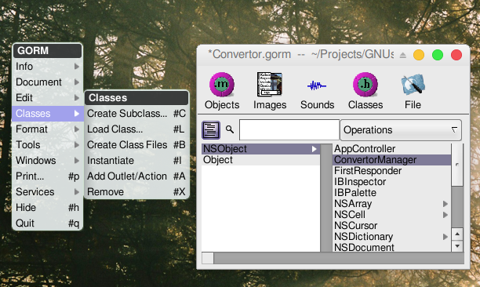
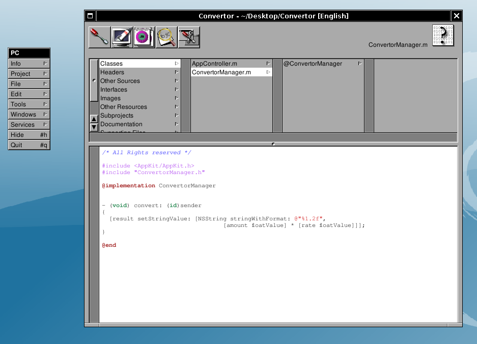

# 2.3 - Adding the Code

## Creating the class's source and header files

Gorm.app can automatically create the skeleton of the class you've designed: select the ConvertorManager class in the Classes panel of the main window, and do Classes&rarr;Create Class Files.



Two successive Save Panels will pop up for the .m and the .h files. Gorm will propose as file names ConvertorManager.m and ConvertorManager.h, it is a good convetion to use the class name as a filename. Save those files into the Project directory.


You may also safely delete the `AppController` object instance if you have it in your Gorm file.

Once this is done, remember to save the interface if you haven't yet, and go back to ProjectCenter.

## Creating the class's source and header files

Adding the class's source and header files to the current project

You now need to add the class's files to the project. Double-click <u>Classes</u> in the first column of the browser, choose the `.m` file to add to the project (`ConvertorManager.m`); the corresponding header file will be automatically added for you.


## Writing the convert: method

Open the `ConvertorManager.m` file by slecting its name within ProjectCenter.app browser. You can display the file in the embedded view or, alternatively, double-clicking will open it in a separate editor.

You should see the following :

```objc
/* All Rights reserved */

#import <AppKit/AppKit.h>
#import "ConvertorManager.h"

@implementation ConvertorManager

- (void) convert: (id) sender
{
  /* insert your code here */
}

@end
```

Add the following inside the convert: method:

```objc
[result setFloatValue: [rate floatValue] * [amount floatValue]];
```

or if you want to have a nicer display:

```objc
[result setStringValue: [NSString stringWithFormat: @"%1.2f",
                            [amount floatValue] * [rate floatValue]]];
```

Save the file.



You may safely remove the `AppController` class from your project, we are not using it.

## Compiling and running

Click  to dispay the building panel. Then click  to build the project. If there is no errors (and hopefully there is none), you can run the application. To do it, click  to display the run panel. Then click the first button (at this time it has still no icon), this should launch the application :


Convertor.app in action, converting between Euro and US Dollar.

**Congratulations, you have completed your first GNUstep app!**