# TimeMachine

## <span id="AEN503">Single Window Application</span>

Single window application is one of the most commonly used application
type. Here, a TimeMachine application is made to demonstrate several
techniques of GNUstep programming.

------------------------------------------------------------------------

## <span id="AEN506">Outlet and Action</span>

I'll write an application which show the current time with a button to
update. It looks like this:

<span id="AEN509"></span>

**Figure 4-1. Simple TimeMachine**

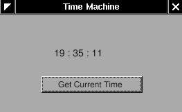

This application is very easy. Just to show how to use "outlet" and
"action" in Gorm, and the relation between "controller" and "view".

Open Gorm, choose "Document&rarr;New Application", and build a window
with a title and a button.

<span id="AEN516"></span>

**Figure 4-2. Interface of simple TimeMachine**


You can set the title of the button in the inspector. So does the title
of window.

<span id="AEN522"></span>

**Figure 4-3. Change title of button**


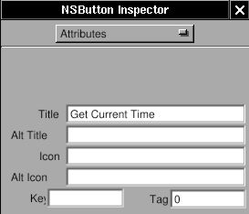

That's all I need to do on the interface.

Now, I need an "controller" to receive the action from the "view", and
display the time on the "view". I need to create a object for this
"controller".

First, I need to design the class of this "controller". Click the
"classes" in the main window of Gorm.

<span id="AEN533"></span>

**Figure 4-4. Classes in Gorm**


It will show all the classes you can use. I want the class of this
"controller" to inherit from NSObject. Therefore, choose "NSObject",
then select the menu "Classes&rarr;Create Subclass...". It will create a
new class under the NSObject.

<span id="AEN539"></span>

**Figure 4-5. Create subclass of NSObject**

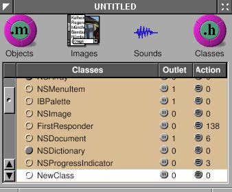

Double-click on it to change the name. I call it "Controller" here.
That's the name of this class.

<span id="AEN545"></span>

**Figure 4-6. Change class name**


Then I need a "outlet" in this class to connect to the label in the
window, and an "action" which is triggered when the button is press.

Choose the "Controller" class and click "Outlets" tab in the inspector.
Press "Add" button, and change the name to "label" by double-clicking
the "newOutlet". You will notice that "Controller" class now has one
outlet. Click on the small round button will list the outlets it has.

<span id="AEN552"></span>

**Figure 4-7. Add outlet**


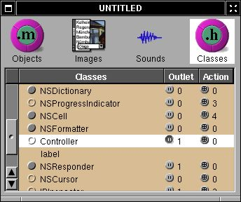

Now, click "Actions" tab and add a new action called "showCurrentTime:".
You should notice that the action is ended with colon (:), which will be
explained later.

<span id="AEN561"></span>

**Figure 4-8. Add action**


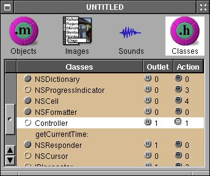

Once I finish designing this class, I can create an instance from it.

Choose the class "Controller", then select the menu
"Classes&rarr;Instantiate". Look at the objects of Gorm main window. You
should find a new instance, called "Controller". That's the instance I
want to connect to the interface.

<span id="AEN571"></span>

**Figure 4-9. NSOwner**

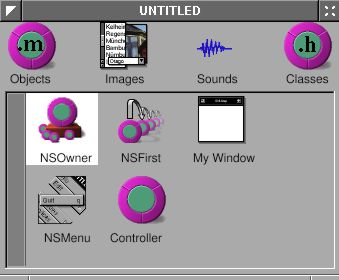

Now, I can connect the "controller" to the "view" for the outlet. Hold
on "Ctrl", select the "Controller" instance, drag to the label in the
window. Look at the inspector, which will show all the outlet the
"Controller" instance has. Select the only one "label", click the
"connect" button. That's it.

<span id="AEN577"></span>

**Figure 4-10. Connect outlet**

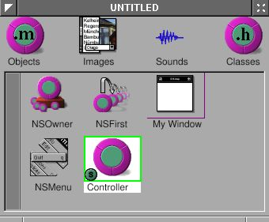

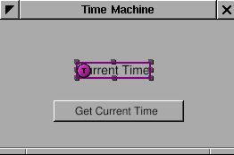

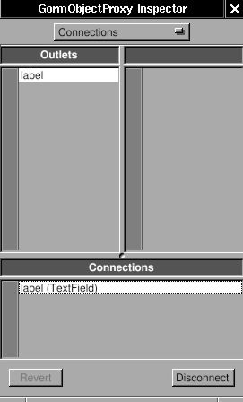

Again, I can connect the "view" to the "controller" for the action. Hold
on "Ctrl", select the button in the window, drag to the "Controller"
instance. Look at the inspector, which will show all the outlet the
button has. Select the "target" in the outlet column, then select the
only one action the target has, "showCurrentTime". Click the "connect"
button. That's it.

<span id="AEN589"></span>

**Figure 4-11. Connect action**

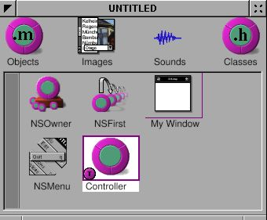

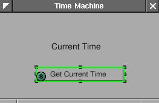

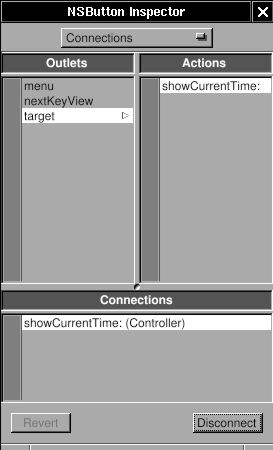

Finally, I need to create the files for this "Controller" class in order
to add the the source code. Otherwise, this class has not function at
all. Select the class "Controller" ( not the instance !) in the Gorm
main window. Choose menu "Classes&rarr;Create Class Files". A "Save"
panel will show up and ask the filename. The default is "Controller.m",
which is good enough. Click "O.K.". Save this Gorm file as
"TimeMachine.gorm", then leave Gorm.

Now, I have a directory, "TimeMachine.gorm", and two file,
"Controller.h" and "Controller.m".

`Controller.h:`

```objc
/* All Rights reserved */

#import <AppKit/AppKit.h>

@interface Controller : NSObject
{
   id label;
}
- (void) showCurrentTime: (id)sender;
@end
```

`Controller.m:`

```objc
/* All Rights reserved */

#import <AppKit/AppKit.h>
#import "Controller.h"

@implementation Controller

- (void) showCurrentTime: (id)sender
{
   /* insert your code here */
}
```

That's the source code of the class "Controller" I just created in Gorm.
The method -showCurrentTime: has the message "sender". That's the reason
the action name in Gorm must has the colon (:) in the end. In the
"Controller.h", you can find the outlet "label" and the action
"showCurrentTime:". Therefore, whatever you do on the outlet "label"
will reflect to the "label" in the interface, and when the button "Get
Current Time" is pressed, the action -showCurrentTime: will be called.
That's how the outlet and action work.

Now, I can put some source code in this class.

`Controller.m:`

```objc
/* All Rights reserved */

#import <AppKit/AppKit.h>
#import "Controller.h"

@implementation Controller

- (void) showCurrentTime: (id)sender
{
   /* insert your code here */
  NSCalendarDate *date = [NSCalendarDate date];
  [date setCalendarFormat: @"%H : %M : %S"];
  [label setStringValue: [date description]];
}
```

First, \[NSCalendarDate date\] will create an instance with the current
date and time. After setting the format, put the description of current
time into the outlet "label". When users click the "Get Current Time"
button, it will show the current time.

That's it. Add the main.m and GNUmakefile, then it is ready to go.

`main.m:`

```objc
#import <AppKit/AppKit.h>

int main(int argc, const char *argv[]) 
{
   return NSApplicationMain (argc, argv);
}
```

`GNUmakefile:`

```makefile
include $(GNUSTEP_MAKEFILES)/common.make

APP_NAME = TimeMachine
TimeMachine_HEADERS = Controller.h
TimeMachine_OBJC_FILES = main.m Controller.m
TimeMachine_RESOURCE_FILES = TimeMachineInfo.plist TimeMachine.gorm
TimeMachine_MAIN_MODEL_FILE = TimeMachine.gorm

include $(GNUSTEP_MAKEFILES)/application.make
```

In this example, the owner of the interface is NSApp, which is the
NSOwner in Gorm, but the controller is the "Controller" instance.
Sometimes, the owner and the controller could be the same. In simple
application, the owner/controller of the window can also be the delegate
of NSApp. That's all depending on the design of your application.

------------------------------------------------------------------------

## <span id="AEN622">Custom View</span>

Gorm can work on the custom view, which is designed by the programmer,
not the built-in GUI component. Here, I continue my "time machine"
application to demonstrate how to do that. The new interface looks like
this:

<span id="AEN625"></span>

**Figure 4-12. TimeMachine with custom view**


Since I want to use the custom view in Gorm, I have to design the class
first. The custom view can inherit from NSView, or NSControl, depending
on what kind of functions you want. Actually, NSControl is a subclass of
NSView. So I will inherit from NSControl. Click on the small circle of
NSResponder to open its subclasses, then do the same thing on NSView and
NSControl. Now, you can see that many GUI component inherit from
NSControl, ex. NSTextField.

<span id="AEN631"></span>

**Figure 4-13. NSControl in Gorm**


I want my custom view, called "TimeView", inherit from NSControl. Choose
"NSControl", then select menu "Classes&rarr;Create Subclass...".
Double-click to change the name.

<span id="AEN637"></span>

**Figure 4-14. Add subclass of NSControl**


You can notice that class "TimeView" also inherits 3 outlets and 7
actions from NSControl. Once the class "TimeView" is created, I can use
it as custom view.

Build the interface as below:

<span id="AEN644"></span>

**Figure 4-15. Interface with custom view**


Look at the "Attributes" in inspector of CustomView. Choose the class
"TimeView".

<span id="AEN650"></span>

**Figure 4-16. Change class of custom view**


The "CustomView" becomes "TimeView". That's it !

<span id="AEN656"></span>

**Figure 4-17. Custom view with TimeView class**


As I did before, create another class for the "controller". Add one
outlet for this "TimeView", and one action for the button. I name the
outlet "timeView".

<span id="AEN662"></span>

**Figure 4-18. Add outlet**


<span id="AEN667"></span>

**Figure 4-19. Add action**


Create an instance of class "Controller". Connect the button to the
action "showCurrentTime", and the outlet "timeView" to the custom view
"TimeView".

<span id="AEN673"></span>

**Figure 4-20. Connect outlet**


Finally, create the class file for the classes "TimeView" and
"Controller". Save this application as "TimeMachine.gorm".

Now, I need to design the interface for the class "TimeView". The class
"TimeView" is actually four NSTextField in a NSBox. The reason that I
made them in one class is because I can reuse it later on. Classes
inherited from NSView will be initialized by calling method
-initWithFrame:. Therefore, I only need to rewrite the method
-initWithFrame: in the class "TimeView". Here are the files:

`TimeView.h:`

```objc
#import <AppKit/AppKit.h>

@interface TimeView : NSControl
{
   NSTextField *labelDate, *labelTime;
   NSTextField *localDate, *localTime;
   NSCalendarDate *date;
}

- (NSCalendarDate *) date;
- (void) setDate: (NSCalendarDate *) date;

@end
```

`TimeView.m:`

```objc
#import <AppKit/AppKit.h>
#import "TimeView.h"

@implementation TimeView
- (id) initWithFrame: (NSRect) frame
{
   NSBox *box;

   self = [super initWithFrame: frame];
   box = [[NSBox alloc] initWithFrame: NSMakeRect(0, 0,
                                                  frame.size.width,
                                                  frame.size.height)];
   [box setBorderType: NSGrooveBorder];
   [box setTitlePosition: NSAtTop];
   [box setTitle: @"Local Time"];

   labelDate = [[NSTextField alloc] initWithFrame: NSMakeRect(10, 45, 35, 20)];
   [labelDate setStringValue: @"Date: "];
   [labelDate setBezeled: NO];
   [labelDate setBackgroundColor: [NSColor windowBackgroundColor]];
   [labelDate setEditable: NO];

   labelTime = [[NSTextField alloc] initWithFrame: NSMakeRect(10, 15, 35, 20)];
   [labelTime setStringValue: @"Time: "];
   [labelTime setBezeled: NO];
   [labelTime setBackgroundColor: [NSColor windowBackgroundColor]];
   [labelTime setEditable: NO];

   localDate = [[NSTextField alloc] initWithFrame: NSMakeRect(55, 45, 130, 20)];
   localTime = [[NSTextField alloc] initWithFrame: NSMakeRect(55, 15, 130, 20)];

   [box addSubview: labelDate];
   [box addSubview: labelTime];
   [box addSubview: localDate];
   [box addSubview: localTime];
   RELEASE(labelDate);
   RELEASE(labelTime);
   RELEASE(localDate);
   RELEASE(localTime);

   [self addSubview: box];
   RELEASE(box);

   return self;
}

- (NSCalendarDate *) date
{
   return date;
}

- (void) setDate: (NSCalendarDate *) aDate
{
   ASSIGN(date, aDate);
   [date setCalendarFormat: @"%a, %b %e, %Y"];
   [localDate setStringValue: [date description]];
   [date setCalendarFormat: @"%H : %M : %S"];
   [localTime setStringValue: [date description]];
}

- (void) dealloc
{
  RELEASE(date);
  [super dealloc];
}

@end
```

When Gorm generates the class files, it contains some default codes in
it. Since I don't need any of them, they are safe to be removed. In
TimeView.h, I declare four NSTextField for display, and on
NSCalendarDate to store the date. I also declare two accessory methods
to set and get the date. In the -initWithFrame, one NSBox is set up, and
four NSTextField is put into it. And class "TimeView" is a subclass of
NSView, I add the NSBox as the subview of the class "TimeView".

Other parts of this application should be very easy. Here are the files:

`Controller.h:`

```objc
#import <AppKit/AppKit.h>
#import "TimeView.h"

@interface Controller : NSObject
{
   id timeView;
}
- (void) showCurrentTime: (id)sender;
@end
```

`Controller.m:`

```objc
#import <AppKit/AppKit.h>
#import "Controller.h"

@implementation Controller
- (void) showCurrentTime: (id)sender
{
   /* insert your code here */
   NSCalendarDate *date = [NSCalendarDate date];
   [timeView setDate: date];
}

@end
```

`main.m:`

```objc
#import <AppKit/AppKit.h>

int main(int argc, const char *argv[]) 
{
   return NSApplicationMain (argc, argv);
}
```

`GNUmakefile:`

```makefile
include $(GNUSTEP_MAKEFILES)/common.make

APP_NAME = TimeMachine
TimeMachine_HEADERS = Controller.h TimeView.h
TimeMachine_OBJC_FILES = main.m Controller.m TimeView.m
TimeMachine_RESOURCE_FILES = TimeMachineInfo.plist TimeMachine.gorm
TimeMachine_MAIN_MODEL_FILE = TimeMachine.gorm

include $(GNUSTEP_MAKEFILES)/application.make
```

You should notice that I didn't instantiate the class "TimeView" in
class "Controller" because when I add an custom view to the window, it
is instantiated automatically. I only need to specify the class the
custom view should be. On the contrary, I have to instantiate the class
"Controller" in Gorm because it is not a GUI component. Without
instantiation, I can't connect the "controller" to the "view".

------------------------------------------------------------------------

## <span id="AEN707">Drawing</span>

I want a graphic clock, which looks like this:

<span id="AEN710"></span>

**Figure 4-21. Custom view with analog clock**

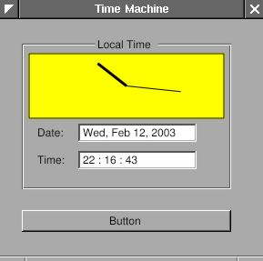

It is very simple. I only need to add a new GUI component in the class
TimeView. I call this new class "ClockView". Since "ClockView" will be
the subview of "TimeView", when "TimeView" is update, I also need to
update the "ClockView".

`ClockView.h:`

```objc
#import <AppKit/AppKit.h>
#include &lt;math.h>

@interface ClockView : NSView
{
   NSPoint posHour, posMinute;
}

- (void) setDate: (NSCalendarDate *) aDate;
@end
```

`ClockView.m:`

```objc
#import "ClockView.h"

@implementation ClockView
- (id) init
{
   self = [super init];
   posHour = NSMakePoint(0,0);
   posMinute = NSMakePoint(0,0);
   return self;
}

- (void) drawRect: (NSRect) frame
{
   NSPoint origin = NSMakePoint(frame.size.width/2, frame.size.height/2);

   NSBezierPath *bp = [NSBezierPath bezierPathWithRect: [self bounds]];
   [[NSColor yellowColor] set];
   [BP fill];

   BP = [NSBezierPath bezierPathWithRect: NSMakeRect(1, 1,
                                                     frame.size.width-2,
                                                     frame.size.height-2)];
   [[NSColor blackColor] set];
   [BP stroke];

   BP = [NSBezierPath bezierPath];
   [BP setLineWidth: 3];
   [BP moveToPoint: origin];
   [BP relativeLineToPoint: posHour];
   [BP stroke];

   [BP setLineWidth: 1];
   [BP moveToPoint: origin];
   [BP relativeLineToPoint: posMinute];
   [BP stroke];
}

- (void) setDate: (NSCalendarDate *) date;
{
   int hour = [date hourOfDay];
   int minute = [date minuteOfHour];
   float hour_x = 40*sin((M_PI*hour/6)+(M_PI*minute/360));
   float hour_y = 40*cos((M_PI*hour/6)+(M_PI*minute/360));
   float minute_x = 60*sin(M_PI*minute/30);
   float minute_y = 60*COs(M_PI*minute/30);

   posHour = NSMakePoint(hour_x, hour_y);
   posMinute = NSMakePoint(minute_x, minute_y);
   [self setNeedsDisplay: YES];
}

@end
```

ClockView inherits from NSView. The most important method it should
override is -drawRect:. When this view need to update, -drawRect: will
be called. Therefore, I put all the drawing in this method. NSBezierPath
is how GNUstep draws. I assign the path, set the color, then draw. There
are good article about drawing: [*Introduction to Cocoa Graphics, Part
I*](http://www.macdevcenter.com/pub/a/mac/2001/10/19/cocoa.html), [*Part
II*](http://www.macdevcenter.com/pub/a/mac/2001/11/06/cocoa.html).

A few codes are needed to include ClockView in TimeView. One is to add
ClockView as a subview of NSBox in TimeView. Another is to update
ClockView when TimeView is update. In method -setDate: of ClockView, it
uses \[self setNeedsDisplay: YES\] to make this view update. This
modification is easy to do. You can play around it.

------------------------------------------------------------------------

## <span id="AEN728">Panel</span>

Panel is a special kind of window. Read the Cocoa document for more
details: [*Windows and
Panels*](http://developer.apple.com/techpubs/macosx/Cocoa/TasksAndConcepts/ProgrammingTopics/WinPanel/index.html).
Since I have a clock already, I want to know the time in different time
zones. My idea is that when I click the title of the NSBox, a panel will
show up and ask the time zone. Once the time zone is inputted, it will
display the time in that area. Since NSPanel is a subclass of NSWindow,
the usage of NSPanel is similar to the NSWindow. Again, I need a
"controller" to control the "view", which is NSPanel in this case.
"View" is generated by Gorm, and I need to write the "controller" by
myself. In this example, I'll show how to load the gorm file. There are
many built-in panel in GNUstep. I also use one in this example.

Firstly, I need to build the interface for the panel. Open Gorm, Choose
menu "Document &rarr; New Module &rarr; New Empty". Look at the palettes.
There is one for panel.

<span id="AEN734"></span>

**Figure 4-22. Panel in Gorm**


Drag the panel out of palettes. Build the interface as below.

<span id="AEN740"></span>

**Figure 4-23. Interface of time zone panel**

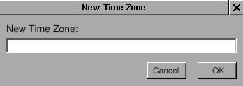

You can change the size of panel in the inspector. Here is the
attributes of this panel I use.

<span id="AEN746"></span>

**Figure 4-24. Panel attributes**

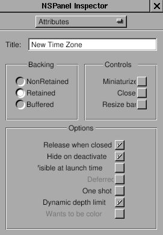

Now, I got the "view". Then where is the "controller" ? Generally, I can
write a new class as the controller of this view, but this is a small
program. It is not necessary to write a new class only as the
controller. So I decide to use the class "TimeView" as the controller
for this panel. So class "TimeView" acts as the custom view for that
main window interface, and the controller for the panel. Since
"TimeView" is the controller of this panel, I need to connect the
outlets and actions. Therefore, I need to create the class "TimeView"
again in this gorm file, even though there is already one in
TimeMachine.gorm file.

You already know how to create the class "TimeView". I add two outlets,
"zonePanel" and "zoneField", and two actions, "okAction:" and
"cancelAction:".

<span id="AEN753"></span>

**Figure 4-25. Outlets for time zone panel**

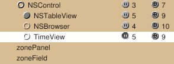

<span id="AEN758"></span>

**Figure 4-26. Actions for time zone panel**


But rather than creating an instance to connect the panel, I'll set the
owner of this panel as the class "TimeView". The advantage is that I can
reduce the number of instances to use.

Select the NSOwner in Gorm main window, then select class "TimeView" in
"attributes" of inspector.

<span id="AEN765"></span>

**Figure 4-27. Set NSOwner to TimeView class**

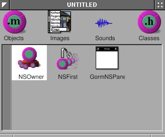


By this way, I can connect the panel to the NSOwner, which is an
instance of class "TimeView". Connect the two buttons to the actions in
NSOwner, the outlet "zoneField" to the NSTextField in panel, and the
outlet "zonePanel" to the panel. Pay attention to how the NSOwner
connects to the panel.

<span id="AEN774"></span>

**Figure 4-28. Connect outlet**

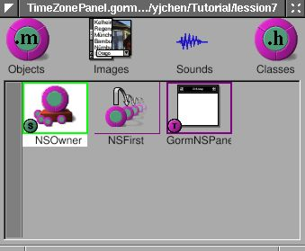

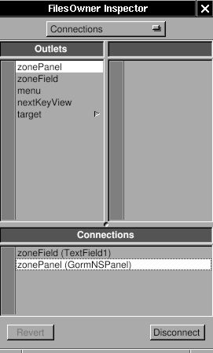

Save this interface as "TimeZonePanel.gorm" file, and quit Gorm. Don't
generate the files for class "TimeView" because I already have the
files. GNUstep can figure out where the classes are and where the
outlets/actions are.

Now, I need to add the new outlets and actions into the files of
"TimeView". Here is the header.

`TimeView.h:`

```objc
#import <AppKit/AppKit.h>
#import "ClockView.h"

@interface TimeView : NSControl
{
   id zonePanel;
   id zoneField;
   NSBox *box;
   NSTextField *labelDate, *labelTime;
   NSTextField *localDate, *localTime;
   NSCalendarDate *date;
   ClockView *clockView;
}

- (NSCalendarDate *) date;
- (void) setDate: (NSCalendarDate *) date;
- (void) okAction: (id) sender;
- (void) cancelAction: (id) sender;
@end
```

I add the outlets and actions by myself.

`TimeView.m:`

```objc
- (void) mouseDown: (NSEvent *) event
{
   NSRect titleFrame = [box titleRect];
   NSPoint windowLocation = [event locationInWindow];
   NSPoint viewLocation = [self convertPoint: windowLocation fromView: [self superview]];
   BOOL status = NSMouseInRect(viewLocation, titleFrame, NO);
   if (status == YES)
     {
       [NSBundle loadNibNamed: @"TimeZonePanel.gorm" owner: self]; 
       [NSApp runModalForWindow: zonePanel];
     }
}
```

The method -mouseDown: is called when mouse is clicked within this view.
Here, I calculate whether the mouse is clicked in the area of the title
of NSBox. If so, use \[NSBundle loadNibName: owner:\] to load the
window, and \[NSApp runModalForWindow\] display it. Read Cocoa's
document about "[*How Modal Windows
Work*](http://developer.apple.com/techpubs/macosx/Cocoa/TasksAndConcepts/ProgrammingTopics/WinPanel/Concepts/UsingModalWindows.html#CJBEADBA)".

Now, I just need to finish the actions part in `TimeView.m`.

`TimeView.m:`

```objc
- (void) cancelAction: (id) sender
{
   [NSApp abortModal];
   [zonePanel close];
}

- (void) okAction: (id) sender
{
   NSTimeZone *tempZone;
   tempZone = [NSTimeZone timeZoneWithName: [zoneField stringValue]];
   [NSApp stopModal];
   [zonePanel close];
   if (tempZone == nil)
      {
         NSRunAlertPanel(@"Warning!",
                         @"Wrong Time Zone !!",
                         @"OK", nil, nil);
      }
   else
      {
         [date setTimeZone: tempZone];
         [box setTitle: [tempZone description]];
         [self setDate: date];
      }
}
```

In method -okAction:, I use a built-in panel, NSRunAlertPanel. There are
several built-in panels in GNUstep ready to use. Now, you can display
the current time in different time zone.

It is inconvenient to use this pop-up panel because you have to click
the NSTextField before typing. Sometimes, it is more convenient to
control the user interface via keyboard rather than mouse. Here, I touch
a little bit this topic to make the panel more easy to use.

When a window pop-up, it is the first object to receive events and
key-in. It is called the "First Responder". But usually we want some
other objects in this window to receive the key-in. Therefore, we need
to change the "first responder" of this window, which I can do that by
using \[NSWindow makeFirstResonpder:\].

When I want to use "Tab" key to switch between different views in the
window, I need to assign the "nextKeyView" for the next view when "Tab"
key is pressed so that the application know where the responder should
be.

Finally, when I finish typing in the NSTextField, I want to hit the
"Return" key equivalent to press the "OK" button by mouse so that I
don't need to move my hand out of the keyboard. In this case, since
NSTextField is also a subclass of NSControl, I can set the target and
action of NSTextField the same as the NSButton "OK". Therefore, when I
hit the "Return", it is equivalent to click on the "OK" button.

These are small tune-ups for the application, but it makes users more
easy to use the application.

Firstly, let's set the "first responder" of the window to the
NSTextField:

`TimeView.m:`

```objc
- (void) mouseDown: (NSEvent *) event
{
   NSRect titleFrame = [box titleRect];
   NSPoint windowLocation = [event locationInWindow];
   NSPoint viewLocation = [self convertPoint: windowLocation fromView: [self superview]];
   BOOL status = NSMouseInRect(viewLocation, titleFrame, NO);
   if (status == YES)
      {
         [NSBundle loadNibNamed: @"TimeZonePanel.gorm" owner: self]; 
         [zonePanel makeFirstResponder: zoneField];
         [NSApp runModalForWindow: zonePanel];
      }
}
```

Only one line is enough. Now, when this panel shows up, the cursor will
automatically in the NSTextField, and this NSTextField are ready to
type.

Secondly, I want to set the target and action of NSTextField the same as
the NSButton "O.K.". Open the TimeZonePanel.gorm, connect the
NSTextField to the method -okAction: of the NSOwner. That's it. Whenever
you hit the "Return" key in the NSTextField, the method -okAction: is
called.

<span id="AEN814"></span>

**Figure 4-29. Connection NSTextField action**

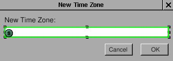

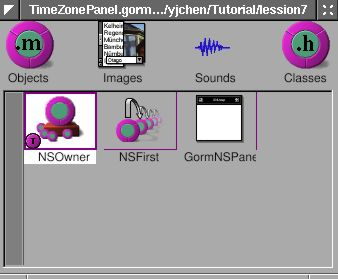

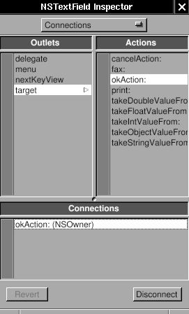

Thirdly, I need to connect the nextKeyView outlet between the views in
the window. I'll connect the nextKeyView of NSTextField to NSButton
"O.K.", the nextKeyView outlet of NSButton "O.K." to NSButton "Cancel",
and the nextKeyView outlet of NSButton "Cancel" to the NSTextField. By
doing that, I can switch between these views by "Tab" key. Here, I just
show how the nextKeyView of NSTextField connects to NSButton "O.K.". You
can do the rest of the part.

<span id="AEN826"></span>

**Figure 4-30. Connect nextKeyView**


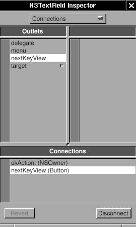

Source code:
[Panel-src.tar.gz](http://gnustep.made-it.com/GSPT/Panel/Panel-src.tar.gz).

------------------------------------------------------------------------

## <span id="AEN836">Notification</span>

Since I can change the time zone, I would like to display several clock
at the same window, and adjust the number of clocks dynamically. First,
I need to add new submenu: "Edit", and two menu item in it: "Add Clock"
and "Delete Clock". Then add two action in the class "Controller":
"addClock:" and "deleteClock". Connect the menu item to the action in
the instance of class "Controller" in the gorm file. Then I have done
the part of interface. When user select the menu item "Add Clock", the
method "addClock:" will be called, so does the menu item "Delete Clock".

Now, how do I manage these clocks dynamically ? I can trace each of them
manually, but it will be complicated. Another way is that I don't trace
any of them, but the problem is how do it control any of them ? I can
use the notification in GNUstep, which is a pretty handy way to
communicate between objects.

Here is a related article:
[*NSNotificationCenter*](http://cocoadevcentral.com/articles/000029.php)

Firstly, I need to adjust the interface according to the adding and
deleting clock. I need trace how many clocks exist so that I won't
accidentally delete the last clock.

`Controller.h:`

```objc
#import <AppKit/AppKit.h>
#import "TimeView.h"

@interface Controller : NSObject
{
   id timeView;
   unsigned int totalNumber;
}

- (void) showCurrentTime: (id) sender;
- (void) addClock: (id) sender;
- (void) deleteClock: (id) sender;
@end
```

I add a variable, totalNumber to trace the number of clocks, and add two
actions manually since I didn't generate the class files from Gorm.

`Controller.m:`

```objc
- (id) init
{
   self = [super init];
   totalNumber = 1;
   return self;
}

- (void) addClock: (id) sender
{
   TimeView *aView;
   NSWindow *mainWindow = [NSApp mainWindow];
   NSRect windowFrame, timeViewFrame;
   windowFrame = [mainWindow frame];
   timeViewFrame = [timeView frame];

   [mainWindow setFrame: NSMakeRect(windowFrame.origin.x,    
                                    windowFrame.origin.y,
                                    windowFrame.size.width+timeViewFrame.size.width, 
                                    windowFrame.size.height)
                display: YES];
   aView = [[TimeView alloc] initWithFrame: NSMakeRect(timeViewFrame.origin.x + totalNumber*timeViewFrame.size.width,
                                                       timeViewFrame.origin.y,
                                                       timeViewFrame.size.width,
                                                       timeViewFrame.size.height)];
   
   [[mainWindow contentView] addSubview: aView];
   RELEASE(aView);
   totalNumber ++;
}

- (void) deleteClock: (id) sender
{
   NSArray *subviews;
   NSWindow *mainWindow = [NSApp mainWindow];
   NSRect windowFrame, timeViewFrame;
   int i;
   windowFrame = [mainWindow frame];
   timeViewFrame = [timeView frame];

   subviews = [[mainWindow contentView] subviews];

   for (i = [subviews count]-1; i > 1; i--) 
     {
       if ([[subviews objectAtIndex: i] isMemberOfClass: [TimeView class]])  
       [[subviews objectAtIndex: i] removeFromSuperview];
       totalNumber--;
       [mainWindow setFrame: NSMakeRect(windowFrame.origin.x,
                                        windowFrame.origin.y,
                                        windowFrame.size.width-timeViewFrame.size.width,
                                        windowFrame.size.height)
                    display: YES];
       break;
     }
}
```

In the method -init, I initiate the variable, totalNumber, as 1 since
there is already one in the Gorm file. In method -addClock:, I have to
calculate the change of window size and where to put the new clock. They
are done by very simple calculation. Once I add the new clock into the
window, the window will retain this clock. Therefore, I can release it
and no longer trace it. In the method -deleteClock:, I also need to
change the size of window by simple calculation. The only problem is
that since I don't trace the clocks, how do I delete them ? I can get
all the subviews from the window, and delete from the last "TimeView"
object. That's the way I can access the objects in the window. Very easy
to maintain.

Now, if you hit the button "Get Current Time", you will notice that only
the origin clock is updated. That's because it is the only one which is
connected by the outlet. I can get all the subviews from the window, and
call their method one by one. That will work, but is not a elegent way.
I can use the "Notification" and "Notification Center" to archive this
goal. Read the [*Cocoa
document*](http://developer.apple.com/techpubs/macosx/Cocoa/TasksAndConcepts/ProgrammingTopics/Notifications/index.html)
for more details.

The idea is that an object can be a speaker, and many objects can be the
audience. So one talks, many listen. That's the way it works. So when
user press the button "Get Current Time", the "Controller" must speak to
all the clocks. Below is how it speak:

`Controller.h:`

```objc
- (void) showCurrentTime: (id)sender
{
   [[NSNotificationCenter defaultCenter] postNotificationName: @"TimeViewShouldUpdateCurrentTime"
                                                       object: [NSCalendarDate date]];
}
```

Actually, it talks to the "Notification Center", and the notification
center will broadcast what it say. I need to specify the name of
notification because there are so many notifications on the air. The
name of notification is the way to distinguish them. And a notification
can contain an object within it. That's how the speaker and audience
transfer the information. It can be nil. Here, I use \[NSCalendarDate
date\].

Now, the speaker speaks. How do the audience listen ? In this example,
all the instance of class TimeView should listen in order to update the
current time. I need to register the audience to the notification center
so that they can receive the notification.

`TimeView.m:`

```objc
- (id) initWithFrame: (NSRect) frame
{
   self = [super initWithFrame: frame];

   box = [[NSBox alloc] initWithFrame: NSMakeRect(0, 0,
                                                  frame.size.width,
                                                  frame.size.height)];
   [box setBorderType: NSGrooveBorder];
   [box setTitlePosition: NSAtTop];
   [box setTitle: @"Local Time"];

   clockView = [[ClockView alloc] initWithFrame: NSMakeRect(0, 70, 
                                                            frame.size.width,
                                                            frame.size.height)];
   labelDate = [[NSTextField alloc] initWithFrame: NSMakeRect(10, 45, 35, 20)];
   [labelDate setStringValue: @"Date: "];
   [labelDate setBezeled: NO];
   [labelDate setBackgroundColor: [NSColor windowBackgroundColor]];
   [labelDate setEditable: NO];

   labelTime = [[NSTextField alloc] initWithFrame: NSMakeRect(10, 15, 35, 20)];
   [labelTime setStringValue: @"Time: "];
   [labelTime setBezeled: NO];
   [labelTime setBackgroundColor: [NSColor windowBackgroundColor]];
   [labelTime setEditable: NO];

   localDate = [[NSTextField alloc] initWithFrame: NSMakeRect(55, 45, 130, 20)];
   localTime = [[NSTextField alloc] initWithFrame: NSMakeRect(55, 15, 130, 20)];

   [box addSubview: clockView];
   [box addSubview: labelDate];
   [box addSubview: labelTime];
   [box addSubview: localDate];
   [box addSubview: localTime];
   RELEASE(clockView);
   RELEASE(labelDate);
   RELEASE(labelTime);
   RELEASE(localDate);
   RELEASE(localTime);

   [self addSubview: box];
   RELEASE(box);
   [[NSNotificationCenter defaultCenter] addObserver: self
                                            selector: @selector(setDate:)
                                                name: @"TimeViewShouldUpdateCurrentTime"
                                              object: nil];
   [self showCurrentTime: self];
   return self;
}
```

Only one line is needed for register. It specify what object to receive
the notification (addObserver:), which method to handle the notification
(selector:), what's the name of notification (name:), and what's the
object of the notification. It is important that the name of
notification should be the same as what the speaker use. So once the
speaker say "TimeViewShouldUpdateCurrentTime", the objects which
register them using "TimeViewShouldUpdateCurrentTime" will receive the
notification, and the selector will be called. The "object: nil" means
that this object accept all the notification with the name
"TimeViewShouldUpdateCurrentTime" no matter what kind of object it
carries on.

Now, I register the TimeView for the notification
"TimeViewShouldUpdateCurrentTime". Once the speaker speak, the method
-setDate: will be called. So I need to set up this method.

`TimeView.m:`

```objc
- (void) setDate: (NSNotification *) not
{
   ASSIGN(date, [not object]);
   [date setTimeZone: [NSTimeZone timeZoneWithName: [box title]]];
   [date setCalendarFormat: @"%a, %b %e, %Y"];
   [localDate setStringValue: [date description]];
   [date setCalendarFormat: @"%H : %M : %S"];
   [localTime setStringValue: [date description]];
   [clockView setDate: date];
}
```

I reuse the -setDate in previous lesson, but change the interface
because right now, it is called by notification center. And I can get
the object the notification carries on by using \[NSNotification
object\] method.

Finally, I need to remove the observer from notification center when it
is released. Otherwise, it causes problems. So here is the -dealloc.

`TimeView.m:`

```objc
- (void) dealloc
{
   [[NSNotificationCenter defaultCenter] removeObserver: self];
   RELEASE(date);
   [super dealloc];
}
```

To sum up, the speaker speak to notification center with a specific name
of notification, and may or may not carry an object with the
notification. The audience register themselves to notification center
with what kinds of notification they want to receive by the name of
notification. When notification center get the notification, it will
call the registered method in the audience.

There are some source codes needed to be modified due to the change of
setDate: method. They are not shown here, and it's not hard to figure
them out.

Since I can update all the clocks manually, I can do it automatically.
NSTimer is a timer which can trigger an action after a given time
repeatly or not. Here, I'll use a NSTimer to make the clock "run".

I need to add new submenu: "Timer", and two menu item: "Start" and
"Stop". Add two action in class "Controller": "startTimer:" and
"stopTimer:". Then connect the menu item to the action. This should be
very easy now.

<span id="AEN884"></span>

**Figure 4-31. Connect menu action**


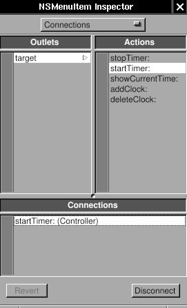

Add these two actions and a NSTimer in Controller.

`Controller.h:`

```objc
#import <AppKit/AppKit.h>
#import "TimeView.h"

@interface Controller : NSObject
{
   id timeView;
   unsigned int totalNumber;
   NSTimer *timer;
}
- (void) showCurrentTime: (id) sender;
- (void) addClock: (id) sender;
- (void) deleteClock: (id) sender;
- (void) startTimer: (id) sender;
- (void) stopTimer: (id) sender;
@end
```

`Controller.m:`

```objc
- (void) startTimer: (id) sender
{
  timer = [NSTimer scheduledTimerWithTimeInterval: 1
                                           target: self
                                         selector: @selector(showCurrentTime:)
                                         userInfo: nil
                                          repeats: YES];
}

- (void) stopTimer: (id) sender
{
  [timer invalidate];
}
```

That's all. In NSTimer, set the interval, target, selector (action), and
repeats. Then it will trigger the action -showCurrentTime: every second.
Use -invalidate to stop the timer. Generally, you need to write a thread
in order not to block the user interface. But with the help of timer,
you can totally avoid this problem. Finger (in gnustep/usr-apps/) is
another good example how to avoid thread using non-blocking I/O.

```{caution}
Since timer is autoreleased, it might disappear anytime in this example, which causes serious memory problem, and usually make application unstable. It would be better to retain the timer in `-startTimer:` and release it in `-stopTimer:`, and to ensure that only one timer exist when user click the "start" menu more than once.
```

------------------------------------------------------------------------