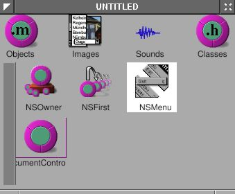
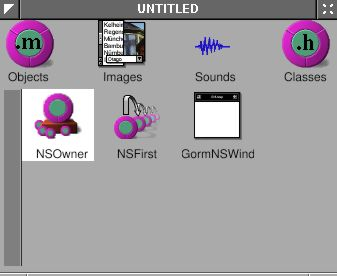
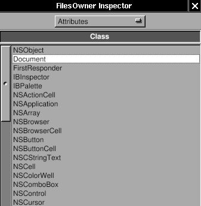
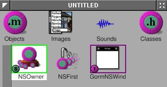
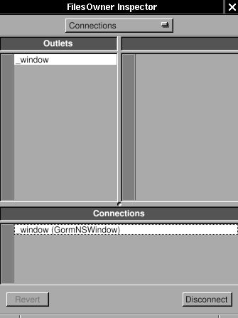
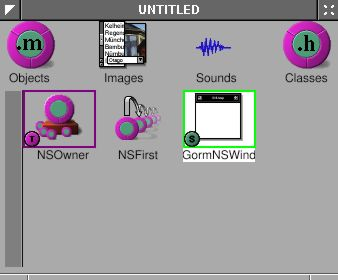
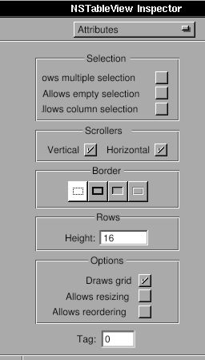
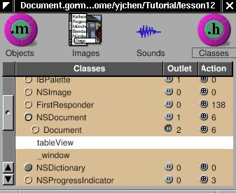
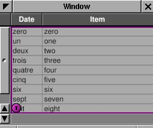
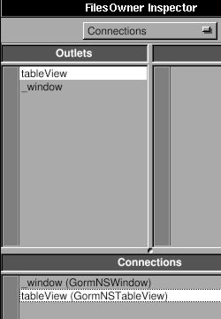

# 4 - Money

In this tutorial, you'll learn to build a document-based application.

## Topics

* Document-based applications

# 4.1 - The Basics

Have you ever used a document-based application? I'd bet you have -- document-based applications are one of the most common types of applications. Computers would be useless without them. Document-based applications are applications that interact with documents, such as text files, pictures, videos, and code. Web browsers are also document-based applications. In fact, document-based applications were invented long before computers -- typewriters are essentially document-based applications, and you could argue that pen and paper are also document-based.

OpenStep, and therefore Cocoa and GNUstep, comes with built-in support for document-based applications in its Application Kit. This tutorial won't cover everything you need to know about them -- please read the [*Cocoa document about document-based applications*](https://web.archive.org/web/2004if_/http://developer.apple.com/documentation/Cocoa/Conceptual/Documents/index.html).
Otherwise, you probably will not know what I
am doing. 

Document-based apps look complicated at first -- you have to deal with
`NSDocumentController`, `NSWindowController`, `NSDocument` and `NSWindow`.
However, since we'll use Gorm to build the `NSWindow`, and
`NSDocumentController` and `NSWindowController` are not required to
subclass, `NSDocument` is the only class we have to deal with. That makes
everything very easy.

In this section, we only make the skeleton of the
document-based application. We'll add more features in the next part of this tutorial.

## Skeleton user interface

Now, we have to create the main user interface. Since it' i's a
document-based application, there is no main window. We only need
a menu so that users can open, save and close each document. 

Open Gorm, choose "Document&rarr;New Application". Click the window in the
Gorm main window, use "Edit&rarr;Delete" to delete the window. Drag the
menus "Info" and "Document" into the main menu. The main user interface
will be like this:

<span id="AEN915"></span>

**Figure 4-32. Menu of document-based application**


```{note}
Not having a main window can cause problems if you're using a global or local menu bar, rather than a floating menu. Additionally, it's not what users expect except on macOS. We'll address these issues later.
```

Next, I need a `NSDocumentController`. Choose the class
`NSDocumentController`, and use menu item "Classes&rarr;Instantiate" to make an
instance.

<span id="AEN922"></span>

**Figure 4-33. Create instance of `NSDocumentController`**



The main user interface is done. Save it as "Money.gorm".

`NSDocumentController` will look at the property list of this application
in order to know what kind of document it should handle. Here is the property list we'll be using:

`MoneyInfo.plist`

```plist
{
    ApplicationDescription = "Money";
    ApplicationIcon = "";
    ApplicationName = Money;
    ApplicationRelease = 0.1;
    Authors = "";
    Copyright = "Copyright (C) 200x by ...";
    CopyrightDescription = "Released under...";
    FullVersionID = 0.1;
    URL = "";
    NSTypes = (
        {
            NSName = "mon";
            NSHumanReadableName = "Money Document";
            NSUnixExtensions = ("mon");
            NSRole = Editor;
            NSDocumentClass = Document;
        }
    );
}
```

The important part is that `NSTypes` defines what kinds of documents our application, "Money", 
can handle, and what class (which should be a subclass of `NSDocument`) handles the document. In this case, *Money.app* edits "Money Documents" with file extension `.mon`, using the class `Document`, which we haven't implemented yet. This is a simplified property
list, but it works. Look at [`InkInfo.plist`](https://github.com/gnustep/tests-examples/blob/master/gui/Ink/InkInfo.plist) from the *Ink* example application for a better example.

Now, we need to create the class `Document`, and
the window for each document. Open Gorm, choose "Document&rarr;New
Empty". Drag a window out of the palettes. We won't do anything in the window yet -- we'll flesh out the UI in the next section.

Look at the classes in the Gorm main window, and use "Classes&rarr;Create
Subclass" to create a subclass of `NSDocument`, called `Document`.

<span id="AEN936"></span>

**Figure 4-34. Create `NSDocument` subclass**


Don't instantiate it. Instead, we'll make it the owner of the document
window (in <u>Objects</u>). Click the NSOwner in the Gorm main window, and select the <u>Attributes</u> pane in the inspector. Choose the `Document` class.

<span id="AEN942"></span>

**Figure 4-35. Set document as NSOwner of window**





Now, the NSOwner is the class of Document. I need to connect the
`_window` outlet of NSOwner (an instance of `Document`) to the window,

<span id="AEN951"></span>

**Figure 4-36. Connect NSOwner to window**





and the set the delegate of window to the NSOwner (an instance of `Document`).

<span id="AEN960"></span>

**Figure 4-37. Connect delegate to NSOwner**




Finally, use "Classes&rarr;Create Class Files" to create the files of
class `Document`. Save them to Document.m and Document.h. Save the Gorm
file into "Document.gorm".

## Loading the user interface

Now, we have five files: Money.gorm, MoneyInfo.plist, Document.h, Document.m and
Document.gorm (which is actually a special kind of directory, called a "bundle").

`NSDocumentController` knows what class to use because it is written in the
property list file. How does `NSDocument` (or its subclass, `Document`) know what the document viewer is? In this case, *Money.app*'s document viewer is `Document.gorm`. The simplest way to tell `Document` about `Document.gorm` is to implement the method
`-windowNibName:` in `Document`. 

The Document files that Gorm created for us
won't work perfectly. Enter the following code instead:

`Document.h:`

```objc
#import <AppKit/AppKit.h>
#import <AppKit/NSDocument.h>

@interface Document : NSDocument
{
}
@end
```

`Document.m:`

```objc
#import "Document.h"

@implementation Document

- (NSString*) windowNibName {
    return @"Document.gorm";
}

@end
```

I deleted the extra code inherited from `NSDocument`. Include
`<AppKit/NSDocument.h>` explicitly in the header file because `<AppKit/AppKit.h` doesn't
include it (at least on some platforms). The most important part is that I return the name of the
document interface, `Document.gorm`, so that `NSDocument` can find where
the interface are.

Here are the rest of the files:

`main.m:`

```objc
#import <AppKit/AppKit.h>

int main(int argc, const char *argv[]) {
    return NSApplicationMain(argc, argv);
}
```

`GNUmakefile:`

```makefile
include $(GNUSTEP_MAKEFILES)/common.make

APP_NAME = Money
Money_HEADERS = Document.h
Money_OBJC_FILES = main.m \
                   Document.m
Money_RESOURCE_FILES = MoneyInfo.plist \
                       Money.gorm \
                       Document.gorm
Money_MAIN_MODEL_FILE = Money.gorm

include $(GNUSTEP_MAKEFILES)/application.make
```

> Here is the source code:
[Money-src.tar.gz](http://gnustep.made-it.com/GSPT/Money/Money-src.tar.gz)

Compile the application with `make`, and run it with `openapp ./Money.app`.

Once the application starts up, you will see only the menu. Use
"Document&rarr;New" to open a new document. A empty window will show up.
You can keep as many documents as you want. The menu items will be
automatically enabled depending on the existance of the document. Most
menu doesn't work yet.

GNUstep offers a great framework for document-based applications. With GNUstep, we only need to focus on the document itself, and don't need to
worry about how to manage the multiple documents/windows. GNUstep will
handle it perfectly.

------------------------------------------------------------------------

# 4.2 - Document Editor

We now have the skeleton of *Money.app*. I want it be a
spreadsheet-like application to track the expense.
Spreadsheet-like applications need a table. `NSTableView` is a good start.
`NSTableView` is a more complicated user interface than NSButton,
NSTextField, etc. So do NSBrowser, NSOutlineView, NSMatrix, etc. GNUstep
does a great job to make it very easy to use. I'll try to explain it
step by step.

> Here is a related article: [*Getting Started With
`NSTableView`*](http://cocoadevcentral.com/articles/000063.php)

> If you are interested
in text editors, [Ink.app](https://github.com/gnustep/tests-examples/tree/master/gui/Ink) is a good example.

## Creating the table view

Use Gorm to open Document.gorm. Add a table view into the window. Try to
resize it until it fit the whole window.

<span id="AEN996"></span>

**Figure 4-38. Add table into window**


Check the "Horizontal" scroller.

<span id="AEN1005"></span>

**Figure 4-39. Attributes of `NSTableView`**



Look at the <u>Size</u> panel in the inspector of `NSTableView`. Click the line in
the <u>Autosizing</u> box to make them springs.

<span id="AEN1011"></span>

**Figure 4-40. Set resize attribute of table view**


The box represent the `NSTableView`. The straight line or spring represent
the distance relationship. Line outside the box is the distance between
`NSTableView` and its superview. It is the window in this case. The line
inside the box is the size of the `NSTableView`. Straight line means the
distance is fixed, the spring means it is resizable. In this case, when
window is resized, since the distance between `NSTableView` and window is
fixed, `NSTableView` will be resized according to the window. That's the
behavior I want.

You can change the title of the column by double-click on it. But it is
not necessary for now. You will find that it is still hard to control
the interface of `NSTableView` from Gorm. I'll do that programmingly.
Therefore, I need a outlet connected to this `NSTableView` from NSOwner.

Add an outlet, `tableView`, in the class `Document`.

<span id="AEN1019"></span>

**Figure 4-41. Add outlet for table view**



Set NSOwner as the data source and delegate of the `NSTableView`. I'll
explain the data source later.

<span id="AEN1025"></span>

**Figure 4-42. Connect data source and delegate of table view**


Connect the outlet `tableView` to `NSTableView`.

<span id="AEN1037"></span>

**Figure 4-43. Connect outlet to table view**






Save the Gorm file and quit Gorm.

## Basic data source

Add the new outlet in Document.h.

`Document.h:`

```objc
#import <AppKit/AppKit.h>
#import <AppKit/NSDocument.h>

@interface Document : NSDocument
{
    id tableView;
}
@end
```

The way `NSTableView` works is that when it needs to display, it will ask
its data source to provide the data it needs. So we need to implement
two methods to provide `NSTableView` the data it need:

`Document.m:`

```objc
- (int) numberOfRowsInTableView: (NSTableView*) view {
    return 5;
}

- (id)              tableView: (NSTableView*) view
    objectValueForTableColumn: (NSTableColumn*) column
                          row: (int) row
{
    return [NSString stringWithFormat: @"column %@ row %d", 
        [column identifier], row]; 
}
```

The method `-numberOfRowsInTableView:` returns how many rows `NSTableView`
should display -- in this case, we'll display 5 rows. The method
`-tableView:objectValueForTableColumn:row:` returns the value shown in a certain cell in the table.

Now, this application is ready to run, even though it does nothing but
display 5 rows of "column 0 row 0". This is merely a demonstration of how `NSTableView`
works. I provide the number of rows, and the object in a given column
and row. As long as these two kinds of data are provided, the
`NSTableView` can display anything, even a image in the cell. I'll talk
about more details about data sources later on.

> Here is the source code:
[Table-1-src.tar.gz](http://gnustep.made-it.com/GSPT/Table/Table-1-src.tar.gz)

## Configuring the table view

Let's work on the interface first. `NSTableView` is a collection of
`NSTableColumn`s. I want three columns for the date, item and amount. By default, there are two columns. Therefore, I need to add a
`NSTableColumn` into our `NSTableView`.

`Document.m:`

```objc
- (void) windowControllerDidLoadNib: (NSWindowController*) controller
{
    NSTableColumn *column;
    NSArray *columns = [tableView tableColumns];

    column = [columns objectAtIndex: 0];
    [column setWidth: 100];
    [column setEditable: NO];
    [column setResizable: YES];
    [column setIdentifier: @"date"];
    [[column headerCell] setStringValue: @"Date"];

    column = [columns objectAtIndex: 1];
    [column setWidth: 100];
    [column setEditable: NO];
    [column setResizable: YES];
    [column setIdentifier: @"item"];
    [[column headerCell] setStringValue: @"Item"];

    column = [[NSTableColumn alloc] initWithIdentifier: @"amount"];
    [column setWidth: 100];
    [column setEditable: NO];
    [column setResizable: YES];
    [[column headerCell] setStringValue: @"Amount"];
    [tableView addTableColumn: column];
    RELEASE(column);

    [tableView sizeLastColumnToFit];
    [tableView setAutoresizesAllColumnsToFit: YES];
}
```

We adjust the interface of our `NSTableView` in the method
`-windowControllerDidLoadNib`:, which guarantees that the Gorm file is
loaded. This is similar to `-awakeFromNib`. First, we get the existing
columns and change their properties. Second, we create a new `NSTableColumn`
and add it into our `NSTableView`. Finally, we adjust the layout of our
`NSTableView`. This way, we can programatically adjust our `NSTableView` without using Gorm to adjust it. Run this application
again, and you will see the new column.

```{note}
At the time this tutorial was originnally written, Gorm did not allow you to configure `NSTableView`.
```

An important property of `NSTableColumn` is its identifier. Each
`NSTableColumn` has an unique identifier to distinguish them.
The identifier can be any object, but it's usually an `NSString`. The
identifier does not have to be the same as the header of the column, but
should being the same for easier management. So we access the
`NSTableColumn` via its identifier. Many GNUstep objects have identifiers.

## Functional data source

Now that we've finished the interface, we can set up a data source. The data source is an
object which provides the data for `NSTableView`. Therefore, the data source is
the model in the [MVC (Model-View-Controller)
paradigm](http://cocoadevcentral.com/articles/000003.php). Depending on
the behavior of `NSTableView`, we need to implement the proper methods in
the data source of `NSTableView`. We already implemented those methods, but they give the useless "column 0 row 0" messages, instead of useful data from our "Money Document".

The data for `NSTableView` can be considered as an `NSArray` of
`NSDictionary`s. The object in each index of `NSArray` corresponds to each
row of `NSTableView`. And the object of each `NSDictionary` with a given key
corresponds to each `NSTableColumn` with a given identifier. That's the
simplest way to build the model for `NSTableView`. Therefore, I add an
`NSMutableArray` in Document class.

`Document.h:`

```objc
#import <AppKit/AppKit.h>
#import <AppKit/NSDocument.h>

@interface Document : NSDocument
{
    id tableView;
    NSMutableArray* records;
}
@end
```

The "records" will store the data of `NSTableView`. For more information about the usage of
`NSMutableArray`, read [*Basic GNUstep Base Library
Classes*](http://www.gnustep.it/nicola/Tutorials/BasicClasses/).

`Document.m:`

```objc
- (id) init
{
    self = [super init];
    records = [NSMutableArray new];
    return self;
}

- (void) dealloc
{
    RELEASE(records);
    [super dealloc];
}

- (int) numberOfRowsInTableView: (NSTableView*) view
{
    return [records count] + 1;
}

- (id)              tableView: (NSTableView*) view
    objectValueForTableColumn: (NSTableColumn*) column
                          row: (int) row
{
    if (row >= [records count]) {
        return @""; 
    } else {
        return [[records objectAtIndex: row] 
                          objectForKey: [column identifier]];
    }
}
```

We create the instance of `NSMutableArray` in the method `-init`, and release it
in `-dealloc`, which will destroy it if no other object needs it. In the method `-numberOfRowsInTableView:`, we return one plus the amount of records because we want it to display an extra empty row for the user to add new records. Hence, in the
method `-tableView:objectValueForTableColumn:row:`, I have to check
whether the row the `NSTableView` requests is larger than the number of actual records. If so, it is a request for data to show in the empty row. Therefore, we just return an empty string (`@""`). We are using an array of dictionaries to make the key
of the dictionary the same as the identifier of the `NSTableColumn`. So I can
get the object directly by knowing the identifier of `NSTableColumn`. If
you are not using an `NSDictionary` for each row, you can consider
[*Key Value Coding
(KVC)*](http://developer.apple.com/techpubs/macosx/Cocoa/TasksAndConcepts/ProgrammingTopics/KeyValueCoding/index.html),
which offers a similar way to get the right object. Otherwise, you have to
use `if`-`else` to get the right object. The advantage of NSDictionary (or
KVC) will be more clear for data input.

## Data input

Now, we'll add the functionary of data input. First, we have to set the
`NSTableColumn` to editable.

```objc
- (void) windowControllerDidLoadNib: (NSWindowController*) controller {
    NSTableColumn *column;
    NSArray *columns = [tableView tableColumns];

    column = [columns objectAtIndex: 0];
    [column setWidth: 100];
    [column setEditable: YES];
    [column setResizable: YES];
    [column setIdentifier: @"date"];
    [[column headerCell] setStringValue: @"Date"];

    column = [columns objectAtIndex: 1];
    [column setWidth: 100];
    [column setEditable: YES];
    [column setResizable: YES];
    [column setIdentifier: @"item"];
    [[column headerCell] setStringValue: @"Item"];

    column = [[NSTableColumn alloc] initWithIdentifier: @"amount"];
    [column setWidth: 100];
    [column setEditable: YES];
    [column setResizable: YES];
    [[column headerCell] setStringValue: @"Amount"];
    [tableView addTableColumn: column];
    RELEASE(column);

    [tableView sizeLastColumnToFit];
    [tableView setAutoresizesAllColumnsToFit: YES];
}
```

When the user double-clicks a cell, the user can edit the contents of the cell. When the user finishes, the table view will send `-tableView:setObjectValue:forTableColumn:row:` to the data source.

`Document.m:`

```objc
- (void)      tableView: (NSTableView*) view
         setObjectValue: (id) object
         forTableColumn: (NSTableColumn*) column
                    row: (int) row
{
    if (row >= [records count]) {
        [records addObject: [NSMutableDictionary new]];
    }
    [[records objectAtIndex: row] setObject: object
                                     forKey: [column identifier]];
    [tableView reloadData];
}
```

Again, we need to take care of the special situation where user input in the last
empty row. Since it is not in the records, I need to add a new
dictionary item to the records, to represent a new row. Whenever the user inputs the data, it will be
store into records according its row and the identifier of the column. And
the key in the dictionary is the same as the identifier of the `NSTableColumn`.
Hence I can retrieve the data according to the identifier of the column.
Finally I ask the `NSTableView` to reload the data in order to reflect the
change of data source.

Now you can play around this application and input the data. 
> Here is the
source code:
> [Table-2-src.tar.gz](http://gnustep.made-it.com/GSPT/Table/Table-2-src.tar.gz).

This example shows how easy it is to make a real document-based application
without worrying about the management of multiple documents and windows.

------------------------------------------------------------------------

# 4.3 - Load and Save

As a document-based application, *Money.app* has to be able to load and save files. Otherwise, the user will lose their work when they quit the application.
Depending on the structure of the files, I have several choices to
override in `NSDocument`:

<span id="AEN1102"></span>

**Table 4-1. Methods for loading and saving files**

<table>
<tbody>
<tr>
<td> </td>
<td>Load file</td>
<td>Save file</td>
</tr>
<tr>
<td>Single file</td>
<td>loadDataRepresentation:ofType:</td>
<td>dataRepresentationOfType:</td>
</tr>
<tr>
<td>Bundle</td>
<td>loadFileWrapperRepresentation:ofType:</td>
<td>fileWrapperRepresentationOfType:</td>
</tr>
<tr>
<td>Low level</td>
<td>readFromFile:ofType:, readFromURL:ofType:</td>
<td>writeToFile:ofType:, writeToURL:ofType:</td>
</tr>
</tbody>
</table>

Read [*How do I implement saving and loading for simple
files?*](https://web.archive.org/web/2004if_/http://developer.apple.com/documentation/Cocoa/Conceptual/Documents/Tasks/FAQ.html#//apple_ref/doc/uid/20000954/BAJBFGAG),
[*How do I implement document packages (documents that are really
folders, but appear to be opaque
documents)?*](https://web.archive.org/web/2004if_/http://developer.apple.com/documentation/Cocoa/Conceptual/Documents/Tasks/FAQ.html#//apple_ref/doc/uid/20000954/BAJHBHGJ),
and [*How do I implement loading and saving when the simple data or file
wrapper API won't
do?*](https://web.archive.org/web/2004if_/http://developer.apple.com/documentation/Cocoa/Conceptual/Documents/Tasks/FAQ.html#//apple_ref/doc/uid/20000954/BAJIGEFI). (Don't open all the links at once -- they're all on the same FAQ page.)

In this case, `-loadDataRepresentation:ofType:` and
`-dataRepresentationOfType:` are enough.

`Document.m:`

```objc
- (NSData*) dataRepresentationOfType: (NSString*) type
{
    if (type == nil) {
        type = @"mon";
    }
    if ([type isEqualToString: @"mon"]) {
        return [NSArchiver archivedDataWithRootObject: records];
    } else {
        return nil;
    }
}

- (BOOL) loadDataRepresentation: (NSData*) data ofType: (NSString*) type
{
    if ([type isEqualToString: @"mon"]) {
        [records setArray: [NSUnarchiver unarchiveObjectWithData: data]];
        return YES;
    }
   return NO;
}
```

When the user saves the document, `Document` will recieve
`-dataRepresentationOfType:`. The type will be the `NSName` of the `NSType` in the property
list of this application (`MoneyInfo.plist`), which is `mon`. Here, we use `NSArchiver` to
transform the whole `NSArray` into `NSData`, and we don't need to worry about
the format of the file. When document is going to be loaded, it will call
`-loadDataRepresentation:ofType:`. We use `NSUnarchiver` to transform
the `NSData` into `NSArray`. That's all. If you are using your own data
structure, you have to deal with [*data
archives*](https://web.archive.org/web/2004if_/http://developer.apple.com/documentation/Cocoa/TasksAndConcepts/ProgrammingTopics/Archiving/index.html)
by yourself. 
> Here is a related article: [*Using the Property List
Objects and the NSCoding
Protocol*](http://cocoadevcentral.com/articles/000059.php).

```{note}
If you've ever used Python's `pickle`, `NSArchiver` is similar, but doesn't have the problem that pickles actually contain commands that are executed. `NSArchiver` simply represents the data itself as a binary file, not as a list of commands to piece together the data like `pickle` does.
```

The saved data is in binary format, which is usually undesired. Since we
only use the basic data structure, we could save it into an OpenStep-style property list,
which is human-readable.

`Document.m:`

```objc
- (NSData*) dataRepresentationOfType: (NSString*) type
{
    if (type == nil) {
        type = @"mon";
    }
    if ([type isEqualToString: @"mon"]) {
        return [[records description] 
            dataUsingEncoding: [NSString defaultCStringEncoding]];
    } else {
        return nil;
    }
}

- (BOOL) loadDataRepresentation: (NSData*) data ofType: (NSString*) type
{
    if ([type isEqualToString: @"mon"]) {
        NSString *string = [[NSString alloc]
            initWithData: data 
                encoding: [NSString defaultCStringEncoding]];
        [records setArray: [string propertyList]];
        RELEASE(string);
        return YES;
    }
    return NO;
}
```

I use -description to get the property list, which is NSString. Then use
-dataUsingEncoding to transform property list (NSString) into NSData for
saving. And do the opposite for the loading. Now, you can look at the
saved file, which is very easy to read.

> Here is the source code for the easy-read version:
[LoadSave-src.tar.gz](http://gnustep.made-it.com/GSPT/LoadSave/LoadSave-src.tar.gz).

```{note}
On macOS, this will save as an XML or binary property list, since macOS no longer uses OpenStep-style property lists.
```

If you are saving the document into a directory, such as if your app saves rich text documents with images, you may want to use
`-loadFileWrapperRepresentation:ofType:` and
`-fileWrapperRepresentationOfType:`. The methods `-readFromFile:ofType:` and
`-writeToFile:ofType:` offer the ability to access the file system
directly.

------------------------------------------------------------------------

# 4.4 - Drag and Drop

[*Drag and drop in
general*](https://web.archive.org/web/2004if_/http://developer.apple.com/documentation/Cocoa/TasksAndConcepts/ProgrammingTopics/DragandDrop/index.html)
is easy, but even easier in `NSTableView`. Here is an article about it:
[*Drag and Drop
Destinations*](http://cocoadevcentral.com/articles/000056.php).
Basically, drag and drop is copy and paste with graphic interactivity.
Therefore, it involves the pasteboard. I'll add the fuction of drag and
drop in this tutorial so that you can drag and drop in-between different
document. `NSTableView` has its built-in drag and drop support. Therefore,
it is sort of different from drag and drop in general. Here is the
[*drag and drop in `NSTableView` from
Cocoa*](https://web.archive.org/web/2004if_/http://developer.apple.com/documentation/Cocoa/TasksAndConcepts/ProgrammingTopics/TableView/Tasks/UsingDragAndDrop.html).

Firstly, I need to set up the dragging source, the source you can drag
something out. I need to register the table as dragging source, and
implement one method.

`Document.m:`

```objc
- (void) windowControllerDidLoadNib: (NSWindowController*) controller {
    NSTableColumn *column;
    NSArray *columns = [tableView tableColumns];

    column = [columns objectAtIndex: 0];
    [column setWidth: 100];
    [column setEditable: YES];
    [column setResizable: YES];
    [column setIdentifier: @"date"];
    [[column headerCell] setStringValue: @"Date"];

    column = [columns objectAtIndex: 1];
    [column setWidth: 100];
    [column setEditable: YES];
    [column setResizable: YES];
    [column setIdentifier: @"item"];
    [[column headerCell] setStringValue: @"Item"];

    column = [[NSTableColumn alloc] initWithIdentifier: @"amount"];
    [column setWidth: 100];
    [column setEditable: YES];
    [column setResizable: YES];
    [[column headerCell] setStringValue: @"Amount"];
    [tableView addTableColumn: column];
    RELEASE(column);

    [tableView sizeLastColumnToFit];
    [tableView setAutoresizesAllColumnsToFit: YES];
    
    [tableView registerForDraggedTypes: [NSArray arrayWithObjects: NSGeneralPboardType, nil]];
}

- (BOOL) tableView: (NSTableView*) view
         writeRows: (NSArray *) rows
      toPasteboard: (NSPasteboard *) pboard
{
    id object = [records objectAtIndex: [[rows lastObject] intValue]];
    NSData *data = [NSArchiver archivedDataWithRootObject: object];

    [pboard declareTypes: [NSArray arrayWithObject: @"NSGeneralPboardType"]
                                             owner: nil];
    [pboard setData: data forType: @"NSGeneralPboardType"];
    return YES;
}
```

In method -windowControllerDidLoadNib:, `NSTableView` register what kind
of pasteboard it will use. Once it registers, it is ready to drag and
drop. The [*usage of
pasteboard*](https://web.archive.org/web/2004if_/http://developer.apple.com/documentation/Cocoa/TasksAndConcepts/ProgrammingTopics/CopyandPaste/index.html)
is not covered in this tutorial. Basically, you set the type of
pasteboard, put data in, and take it out.

Method -tableView:writeRows:toPasteboard will be called when user try to
drag some rows out of the table, It is the methods in the data source of
table, not in the delegate of table. Therefore, in this method, I only
need to put the data into pasteboard. Since this table only allow single
selection, I only need to handle the data in one row, which is a
NSDictionary. I archive NSDictionary into NSData, put it into pasteboard
of NSGeneralPboardType, then return YES. Now, you can drag the row out
of the table.

`NSTableView` will handle all the graphic interactivity. When users drop
the data into another document, I need to implement two methods.

`Document.m:`

```objc
- (NSDragOperation) tableView: (NSTableView*) view
                 validateDrop: (id<NSDraggingInfo>) info
                  proposedRow: (int) row
        proposedDropOperation: (NSTableViewDropOperation) operation
{
    if (row > [records count])
    return NSDragOperationNone;

    if (nil == [info draggingSource]) { // From other application
        return NSDragOperationNone;
    }
    else if (tableView == [info draggingSource]) { // From self
        return NSDragOperationNone;
    }
    else { // From other documents 
        [view setDropRow: row dropOperation: NSTableViewDropAbove];
        return NSDragOperationCopy;
    }
}

- (BOOL) tableView: (NSTableView*) view
        acceptDrop: (id<NSDraggingInfo>) info
               row: (int) row
     dropOperation: (NSTableViewDropOperation) operation
{
    NSPasteboard *pboard = [info draggingPasteboard];
    NSData *data = [pboard dataForType: @"NSGeneralPboardType"];

    if (row > [records count]) {
        return NO;
    }

    if (nil == [info draggingSource]) { // From other application
        return NO;
    }
    else if (tableView == [info draggingSource]) { // From self
        return NO;
    }
    else { // From other documents
        id object = [NSUnarchiver unarchiveObjectWithData: data];
        [records insertObject: object atIndex: row];
        [tableView reloadData];

        return YES;
    }
    return NO;
}
```

When users hold the mouse button and move above the table, the table
will keep receiving the call for method
-tableView:validateDrop:proposedRow:ProposedDropOperation:. The only
thing I need to do in this method is to examine the proposed drop and
return the action I can accept. If the source is not from other
documents, return NSDragOperationNone to indicate that this table
doesn't accept drop. Otherwise, return NSDragOperationCopy to indicate
that this table accept copy. In table, you can drop between rows or over
rows. That's NSTableViewDropOperation means. I only want to insert the
data. When it is proposed to drop, I change the propose by
-setDropRow:dropOperation:. By this way, I can change all the drop
in-between rows, not over rows. So this method gives the table chances
to change its interface when mouse is moving above it.

Once users release the mouse button, method
-tableView:acceptDrop:row:dropOperation: will be called. I get the
dropped data from this method. Extract the data from pbastebord,
unarchive into NSDictionary, and add into records. Don't forget to
reload the table to reflect the change.

`NSTableView` offers the basic fuction of drag and drop, which is useful
for general applications. If you want more support for drag and drop,
you have to subclass `NSTableView` and write your own using the general
drag and drop support of GNUstep. For example, `NSTableView` doesn't
support drag and drop from other application. If you want to do that,
you have to subclass `NSTableView`. I'll talk about the drag and drop in
general later.

Here is the source code:
[DragDropInTable-src.tar.gz](http://gnustep.made-it.com/GSPT/DragDropInTable/DragDropInTable-src.tar.gz)
