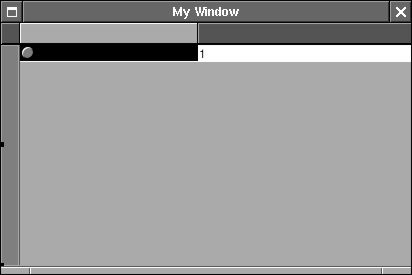
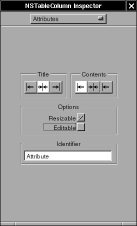
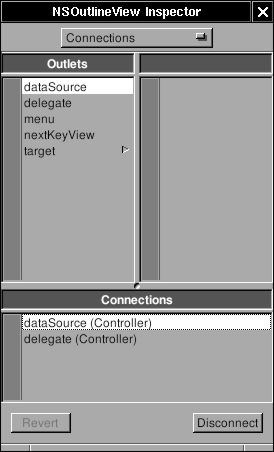

# 5 - Overview

NSOutlineView is a subclass of NSTableView. The only difference is that
the rows of NSOutlineView act like a data-structure tree of multiple
children. In NSTableView, we can use an array of dictionary to store the
data of NSTableView. In NSOutlineView, we need a tree strcuture. Here, I
will make an application to display several system information in
outline view.

First, create "New Application" in Gorm and drag a NSOutlineView into
the window


**Figure 4-44. Interface of Overview**


Change the Autoresizing attribute of NSOutlineView


**Figure 4-45. Autoresizing attribute of NSOutlineView**


Double-click on the column to select


**Figure 4-46. Select column in NSOutlineView**



Uncheck the "Editable" and change the identifier to "Attribute" in the
first column and "Value" in the second column


**Figure 4-47. Change attribute of NSTableColumn**



The makeing of interface is done. Now, I need a controller for the
interface. Create a subclass of NSObject, called "Controller"


**Figure 4-48. Create subclass in Gorm**


Add a outlet called "outlineview"


**Figure 4-49. Create outlet**


Create an instance of Controller, and connect the outlet "outlineview"
to the outline view in the window. Be sure that you connect to outline
view, not the scroll view or the table column


**Figure 4-50. Connect outlet to NSOutlineView**


Since NSOutlineView is the subclass of NSTableView, we need to assing
the data source and delegate of NSOutlineView by connecting the
"dataSource" and "delegate" from NSOutlineView to Controller.


**Figure 4-51. Connect data source of NSOutlineView**



Finally, we can assign Controller as the delegate of NSApp


**Figure 4-52. Assign delegate of NSApp**


Now, save the Gorm file as "Overview.gorm", and generate the files of
Controller.

I need a data source for the NSOutlineView. I can do that by creating a
tree sturcture with very simple nodes

`Node.h`

```objc
#ifndef _Overview_Node_
#define _Overview_Node_

#include <Foundation/NSObject.h>

@class NSArray;
@class NSMutableArray;
@class NSString;

@interface Node: NSObject
{
  NSString *name;
  NSString *value;
  NSMutableArray *children;
}

- (void) setName: (NSString *) name;
- (NSString *) name;
- (void) setValue: (NSString *) value;
- (NSString *) value;
- (void) addChild: (id) child;
- (NSArray *) children;
@end

#endif /* _Overview_Node_ */
```

`Node.m`

```objc
#include "Node.h"
#include <Foundation/Foundation.h>

@implementation Node

- (id) init
{
  self = [super init];

  children = [NSMutableArray new];

  return self;
}

- (void) setName: (NSString *) string
{
  ASSIGN(name, string);
}

- (NSString *) name
{
  return name;
}

- (void) setValue: (NSString *) string
{
  ASSIGN(value, string);
}

- (NSString *) value
{
  return value;
}

- (void) addChild: (id) child
{
  [children addObject: child];
}

- (NSArray *) children
{
  return children;
}

- (void) dealloc
{
  RELEASE(name);
  RELEASE(value);
  RELEASE(children);
  [super dealloc];
}

@end
```

Now, I can build a tree by connect these nodes

In NSTableView, there are two necessary methods to display the data:

```objc
- (int) numberOfRowsInTableView: (NSTableView *) tableView;

- (id) tableView: (NSTableView *) tableView
       objectValueForTableColumn: (NSTableColumn *) column
       row: (int) row;
```

In NSOutlineView, due to the tree-like structure, there are 4 mecessary
methods to display the data:

```objc
- (id)outlineView: (NSOutlineView *)outlineView 
            child: (int)index 
           ofItem: (id)item;

- (BOOL)outlineView: (NSOutlineView *)outlineView
        isItemExpandable: (id)item;

- (int)outlineView: (NSOutlineView *)outlineView
       numberOfChildrenOfItem: (id)item;

- (id)outlineView: (NSOutlineView *)outlineView 
      objectValueForTableColumn:(NSTableColumn *)tableColumn 
      byItem:(id)item;
```

"Item" means the node in the data source. If item is nil, it means it is
root node. Starting from root node, NSOutlineView ask each node how many
children it has ? is it expandable ? display the object value of the
node, and get the next child. After it goes over the nodes, it finish
displaying the data source.

So I have to build the tree first:

`Controller.h`

```objc
/* All Rights reserved */

#include <AppKit/AppKit.h>

@class Node;

@interface Controller : NSObject
{
  id outlineview;
  Node *root;
  
}
@end
```

`Controller.m`

```objc
/* All Rights reserved */

#include <AppKit/AppKit.h>
#include "Controller.h"
#include "Node.h"

@implementation Controller

- (id) init
{
  Node *child, *temp;

  self = [super init];

  root = [Node new];

  child = [Node new];
  [child setName: @"System"];

  /* Add operating system */
  temp = [Node new];
  [temp setName: @"Operating System"];
  [temp setValue: [[NSProcessInfo processInfo] operatingSystemName]];
  [child addChild: temp];
  RELEASE(temp);

  /* Add user name */
  temp = [Node new];
  [temp setName: @"User Name"];
  [temp setValue: NSUserName()];
  [child addChild: temp];
  RELEASE(temp);

  /* Add home directory */
  temp = [Node new];
  [temp setName: @"Home Directory"];
  [temp setValue: NSHomeDirectory()];
  [child addChild: temp];
  RELEASE(temp);

  [root addChild: child];
  RELEASE(child);

  return self;
}

- (void) dealloc
{
  RELEASE(root);
  [super dealloc];
}
```

I create a root node, add an "System" node. Then add three nodes into
"System" node. That's a very simple tree for now. Once I have a tree, I
can display it in outline view.

`Controller.m`

```objc
- (id) outlineView: (NSOutlineView *) outlineView
             child: (int) index
            ofItem: (id) item
{
  /* Root */
  if (item == nil)
    return [[root children] objectAtIndex: index];

  /* Others */
  if ([[item children] count])
    return [[item children] objectAtIndex: index];
  else
    return nil;
}

- (BOOL) outlineView: (NSOutlineView *) outlineView
         isItemExpandable: (id) item
{
  /* Root */
  if (item == nil)
    return YES;

  /* Others */
  if ([[item children] count])
    return YES;
  else
    return NO;
}

- (int) outlineView: (NSOutlineView *) outlineView
        numberOfChildrenOfItem: (id) item
{
  /* Root */
  if (item == nil)
    return [[root children] count];

  /* Others */
  return [[item children] count];
}

- (id) outlineView: (NSOutlineView *) outlineView
       objectValueForTableColumn: (NSTableColumn *) tableColumn
       byItem: (id) item
{
  if ([[tableColumn identifier] isEqualToString: @"Attribute"])
    return [(Node *)item name];
  else
    return [item value];
}
```

These methods are straight-forward. Just need to take care the case when
item is nil, which means it is root node.

Now, this application is ready to go. You can finish the `main.m` and
`GNUmakefile`. Here is the source code:
[Overview-src.tar.gz](http://gnustep.made-it.com/GSPT/Overview/Overview-src.tar.gz)

Actually I can get more information

`Controller.m`

```objc
- (id) init
{
  Node *child, *temp;
  NSCalendarDate *date;
  NSRect frame;
  id object;

#define ADD_NAME_VALUE(name, value) \
        temp = [Node new]; \
        [temp setName: name]; \
        [temp setValue: value]; \
        [child addChild: temp]; \
        RELEASE(temp);


  self = [super init];

  root = [Node new];

  child = [Node new];
  [child setName: @"System"];

  /* operating system */
  ADD_NAME_VALUE(@"Operating System", [[NSProcessInfo processInfo] operatingSystemName]);

  /* user name */
  ADD_NAME_VALUE(@"User Name", NSUserName());

  /* home directory */
  ADD_NAME_VALUE(@"Home Directory", NSHomeDirectory());

  /* gnustep root directory */
  ADD_NAME_VALUE(@"GNUstep Directory", NSOpenStepRootDirectory());

  /* host and address */
  ADD_NAME_VALUE(@"Host", [[NSHost currentHost] name]);
  ADD_NAME_VALUE(@"Address", [[NSHost currentHost] address]); 

  /* Screen */
  ADD_NAME_VALUE(@"Screen Depth", [[NSNumber numberWithInt: [[NSScreen mainScree
n] depth]] description]);
  frame = [[NSScreen mainScreen] frame];
  object = [NSString stringWithFormat: @"%d x %d", (int)frame.size.width, (int)f
rame.size.height];
  ADD_NAME_VALUE(@"Screen Size", object);

  [root addChild: child];
  RELEASE(child);

  child = [Node new];
  [child setName: @"Date &amp; Time"];

  /* Time Zone */
  ADD_NAME_VALUE(@"System Time Zone", [[NSTimeZone systemTimeZone] timeZoneName]
);
  ADD_NAME_VALUE(@"Local Time Zone", [[NSTimeZone localTimeZone] timeZoneName]);

  /* Date */
  date = [NSCalendarDate calendarDate];
  [date setCalendarFormat: @"%a, %b %e, %Y"];
  ADD_NAME_VALUE(@"Date", [date description]);
  [date setCalendarFormat: @"%H : %M : %S"];
  ADD_NAME_VALUE(@"Time", [date description]);

  [root addChild: child];
  RELEASE(child);

  child = [Node new];
  [child setName: @"Text Related"];

  /* default encoding */
  ADD_NAME_VALUE(@"Default Encoding", [NSString localizedNameOfStringEncoding: [NSString defaultCStringEncoding]]);

  /* Font */
  ADD_NAME_VALUE(@"System Font", [[NSFont systemFontOfSize: [NSFont systemFontSize]] displayName]);
  ADD_NAME_VALUE(@"System Font Size", [[NSNumber numberWithFloat: [NSFont systemFontSize]] description]);
  ADD_NAME_VALUE(@"System Font Encoding", [[NSFont systemFontOfSize: [NSFont systemFontSize]] encodingScheme]);
  ADD_NAME_VALUE(@"System Bold Font", [[NSFont boldSystemFontOfSize: [NSFont systemFontSize]] displayName]);

  [root addChild: child];
  RELEASE(child);

  return self;
}
```

Now, it looks better:


**Figure 4-53. Overview**


You will notice that when window is close, the application is not quit.
We can make the application quit when last window closes.

`Controller.m`

```objc
- (BOOL) applicationShouldTerminateAfterLastWindowClosed: (id) sender
{
  return YES;
}
```

This is the method for NSApp delegate. Therefore, Controller must be the
delegate of NSApp. I assign it already in Gorm

------------------------------------------------------------------------