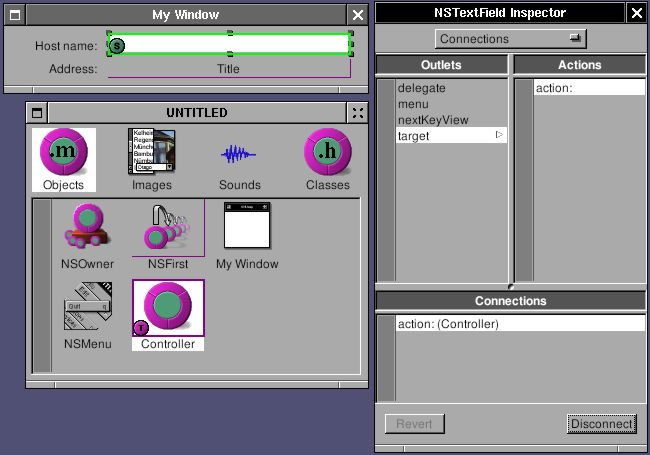

# 7 - NSLookupService

[System
service](http://developer.apple.com/documentation/Cocoa/Conceptual/SysServices/index.html)
is an important feature of GNUstep, which connects applications
together. The basic idea is that any application can be a service
provider. Service provider will offer some functions for other
applications. Through service menu, one application can use the
functions of other applications. They can also exchange the data
in-between. GNUstep offer several basic service by default. Try open
<span class="APPLICATION">Ink.app</span>. Type something, select some
word, choose menu "Services->To upper", then selected word change to
upper case. The function of converting letter into upper case is
provider by <span class="APPLICATION">exampleService</span>, not <span
class="APPLICATION">Ink</span>. Ink simply send the word to
exampleService and get the result back. Through system service, you can
simply throw an email address in the document to a mail client, throw
the url in the document to web browser, or throw the image in
imageviewer to a filter and get the result back. With system service,
applications can concentrate more on its own and communicate with other
applications to expand the functions.

Firstly, let's start with an application which can use system service.
I'll make an simple application which can look up the address of a
hostname. That's the graphic version of **nslookup**.

Open Gorm, make an interface looks like this:


**Figure 5-1. Interface of NSLookupService**


Create a subclass of NSObject called "Controller", and add two outlets:
"hostname" and "address". Connect the outlet to the NSTextField in the
interface.


**Figure 5-2. Connect outlet**


Add an action called "action:" in Controller and connect action of
NSTextField to "action:"


**Figure 5-3. Connect action.**



Connect delegate of NSOwner (NSApp in this case) to Controller since
service is associated with NSApp. It will be useful in the later.


**Figure 5-4. Connect delegate of NSApp**


Modify Controller.m

`Controller.m`

```objc
- (void) action: (id)sender
{
  [address setStringValue: [[NSHost hostWithName: [hostname stringValue]] address]];
}
```

It takes the value in hostname text field and convert into the address.

Now, I want this application be able to use system service provided by
other applications. I only need to add a menu so that menu of system
service can shows up.

`Controller.m`

```objc
- (void) awakeFromNib
{
  NSMenu *mainMenu, *serviceMenu;

  mainMenu = [NSApp mainMenu];

  [mainMenu insertItemWithTitle: @"Services"
                         action: NULL
                  keyEquivalent: @""
                        atIndex: 0];

  serviceMenu = [[NSMenu alloc] initWithTitle: @"Services"];
  [mainMenu setSubmenu: serviceMenu
               forItem: [mainMenu itemWithTitle: @"Services"]];
  [NSApp setServicesMenu: serviceMenu];
  RELEASE(serviceMenu);
}
```

After the Gorm interface is loaded, add a Services menu. The most
important is to assign this menu as the service menu of NSApp. Now,
start this application, type something in the NSTextField, and default
services can be used. The service menu changes depending on the object
you select. If there is no selection, there is no item in the service
menu.

Now, I can provide the service for other applications. Only two things
are need: one is to write the interface of system service, the other is
to implement the system service. The interface of system service is in
the property list of the application. In this case, it is
NSLookupServiceInfo.plist since I name this application as
NSLookupServiceInfo.

`NSLookupServiceInfo.plist`

```objc
{
  NSServices = (
    {
      NSPortName = NSLookupService;
      NSMessage = getAddress;
      NSSendTypes = (NSStringPboardType);
      NSMenuItem = {
        default = "Get Address";
        English = "Get Address";
      };
      NSKeyEquivalent = {
        default = "G";
      };
    }
  );
}
```

In property list, NSPortName is the name of the application. NSMessage
is the method I need to implement later. NSSendTypes is the type of
pasteboard to use when other application want to send data to this
application. In other word, this application only accept
NSStringPboardType, not other data type. NSMenuItem and NSKeyEquivalent
is the menu which will show up in the service menu of all the
applications. The menu will show up only when the selection is the type
of string.

As the NSMessage is getAddress, I have to implement getAddress method.
The interface of this method is fixed as:

```objc
- (void) getAddress: (NSPasteboard *) pboard
           userData: (NSString *) userData
              error: (NSString **) error
```

getAddress: is the name the same as NSMessage. pboard is the pasteboard
which contain the data from other applications. userData is the string
if you have NSUserData in the property list of NSServices. error is the
error message you want to shows up if something wrong.

Now, let's implement this method in Controller.m

`Controller.m`

```objc
- (void) getAddress: (NSPasteboard *) pboard
           userData: (NSString *) userData
              error: (NSString **) error
{
  NSArray *allTypes;
  NSString *name;
```

Check whether pasteboard reall contain NSString type. If not, show the
error.

```objc
  allTypes = [pboard types];

  if ( ![allTypes containsObject: NSStringPboardType] )
    {
      *error = @"No string type supplied by pasteboard";
      return;
    }
```

Get the string out of pasteboard. If there is no string, show the error.

```objc
  name = [pboard stringForType: NSStringPboardType]; 

  if (name == nil)
    {
      *error = @"No string value supplied by pasteboard";
      return;
    }
```

Put the hostname into the NSTextField, check whether it is valid. If
not, show the error. Use -action: to get the address

```objc
  [hostname setStringValue: name];
  if ([[NSHost hostWithName: name] address] == nil)
    {
      *error = @"Host name is not valid";
      return;
    }
  [self action: self];
}
```

Finally, I have to let NSApp know which object in this application
provides the service.

```objc
- (void) applicationDidFinishLaunching: (NSNotification *) not
{
  [NSApp setServicesProvider: self];
}
```

In other word, you can have an object specialized for providing service.

You have to install this application to make the service work, and you
have to run **make\_services** so that GNUstep can know there is a new
service. **make\_services** is a tool of GNUstep, and is called in
GNUstep.sh or GNUstep.csh. Therefore, everytime you login, it is called
automatically. If you install new application which offer system
service, you must manually run **make\_services** or login again.

After runing **make\_services**, open <span
class="APPLICATION">Ink</span>. Type something and select them. Now,
service menu of Ink should show the service provide by NSLookupService.
Choose the menu, and NSLookupService will start automatically. If the
selected string is valid hostname, NSLookupService will show its
address, otherwise, Ink will show the error message provided by
NSLookupService.

If I want to get the value back from NSLookupService, it's easy. Add the
return type in property list:

`NSLookupServiceInfo.plist`

```objc
{
  NSServices = (
    {
      NSPortName = NSLookupService;
      NSMessage = getAddress;
      NSSendTypes = (NSStringPboardType);
      NSReturnTypes = (NSStringPboardType);
      NSMenuItem = {
        default = "Get Address";
        English = "Get Address";
      };
      NSKeyEquivalent = {
        default = "G";
      };
    }
  );
}
```

The return type is also string in this case. In the end of -getAddress:,
I just need to put the return value back into the pasteboard. Whatever
application use this service will get the return value from the
pasteboard.

`Controller.m`

```objc
- (void) getAddress: (NSPasteboard *) pboard
           userData: (NSString *) userData
              error: (NSString **) error
{
  NSArray *allTypes;
  NSString *name;

  allTypes = [pboard types];

  if ( ![allTypes containsObject: NSStringPboardType] )
    {
      *error = @"No string type supplied by pasteboard";
      return;
    }

  name = [pboard stringForType: NSStringPboardType];

  if (name == nil)
    {
      *error = @"No string value supplied by pasteboard";
      return;
    }

  [hostname setStringValue: name];
  if ([[NSHost hostWithName: name] address] == nil)
    {
      *error = @"Host name is not valid";
      return;
    }
  [self action: self];
  /* For return value */
  allTypes = [NSArray arrayWithObject: NSStringPboardType];
  [pboard declareTypes: allTypes owner: nil];
  [pboard setString: [NSString stringWithFormat: @"%@ (%@)", name, [address stringValue]]
            forType: NSStringPboardType];
}
```

In this case, I return the original string with its address appended.
You can test it in <span class="APPLICATION">Ink</span> again.

Here is the source code:
[NSLookupService-src.tar.gz](http://gnustep.made-it.com/GSPT/NSLookupService/NSLookupService-src.tar.gz)

------------------------------------------------------------------------
